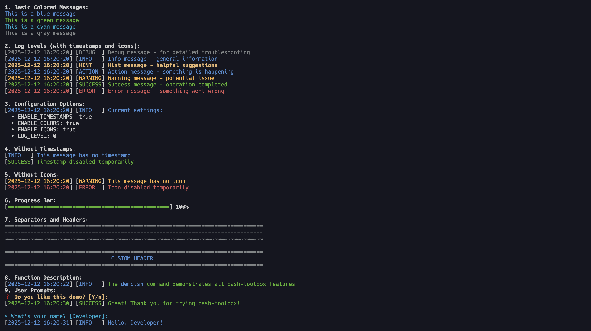

# Bash Toolbox

[](https://opensource.org/licenses/MIT)
[](./docs/CHANGELOG.md)

A lightweight bash library for colored logging, progress indicators, and interactive prompts.

## Features

- **Colored Logging** - Multiple log levels with timestamps and colors
- **Progress Indicators** - Spinner and progress bar
- **Interactive Prompts** - User input and confirmations
- **Configurable** - Environment variables for timestamps, colors, and log levels
- **Pure Bash** - No external dependencies

## Quick Start

No installation needed! Source directly from GitHub:

```bash
source <(curl -s https://raw.githubusercontent.com/MorganKryze/bash-toolbox/main/src/prefix.sh)

# Start using immediately
info "Starting application..."
success "Done!"

# Interactive prompt
name=$(input "Your name?" "User")
if prompt "Continue?" "y"; then
  success "Hello, $name!"
fi
```

## Installation

### Direct Usage (Recommended)

Source directly in your scripts:

```bash
#!/usr/bin/env bash
source <(curl -s https://raw.githubusercontent.com/MorganKryze/bash-toolbox/main/src/prefix.sh)

info "No installation required!"
```

### Local Installation

For offline use or development:

```bash
git clone https://github.com/MorganKryze/bash-toolbox.git
cd bash-toolbox
./demo.sh  # Try it out

# Source locally
source ./src/prefix.sh
```

### Try Examples Instantly

All demo and example scripts work anywhere, even without cloning:

```bash
# Run the full demo
bash -c "$(curl -s https://raw.githubusercontent.com/MorganKryze/bash-toolbox/main/demo.sh)"

# Run any example
bash -c "$(curl -s https://raw.githubusercontent.com/MorganKryze/bash-toolbox/main/examples/simple.sh)"
bash -c "$(curl -s https://raw.githubusercontent.com/MorganKryze/bash-toolbox/main/examples/backup.sh)"
bash -c "$(curl -s https://raw.githubusercontent.com/MorganKryze/bash-toolbox/main/examples/installer.sh)"
```

The scripts automatically load the library from GitHub if not found locally.

## Usage

### Logging

```bash
debug "Debug info"           # Gray, level 0
info "Information"           # Blue, level 1
warning "Warning message"    # Orange, level 2
error "Error occurred"       # Red, level 3
fatal "Fatal error" 1        # Red, exits with code
```

### Progress

```bash
# Spinner
spinner "sleep 3" "Processing..."

# Progress bar
for i in {1..100}; do
  progress_bar $i 100
  sleep 0.05
done
```

### Prompts

```bash
# Yes/no confirmation
if prompt "Delete files?" "n"; then
  action "Deleting..."
fi

# Text input
name=$(input "Enter name" "default")

# Wait for key
acknowledge "Press any key to continue"
```

### Utilities

```bash
separator           # Full-width line
header "SECTION"    # Centered header
blue "Colored text" # Direct color output
```

## Configuration

Set environment variables before sourcing:

```bash
ENABLE_TIMESTAMPS=false  # Disable timestamps
ENABLE_COLORS=false      # Disable colors
LOG_LEVEL=2              # Only warnings and above (0-4)
LOG_FILE="/tmp/app.log"  # Enable file logging

source ./src/prefix.sh
```

## Documentation

See [QUICKREF.md](./docs/QUICKREF.md) for complete function reference and [examples/](examples/) for more usage patterns.

## Requirements

- Bash 4.0+ or zsh 5.0+
- Terminal with color support (optional)

## License

MIT License - see [LICENSE](LICENSE) for details.
